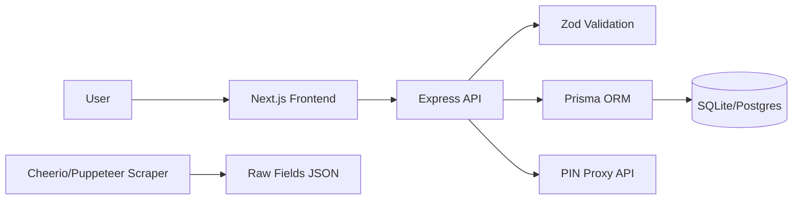

# 🚀 autoUdyam: Responsive Udyam Registration (Steps 1–2)

<p align="center">


</p>

> A clean, mobile‑first replica of the first two steps of the Udyam registration flow (Aadhaar + OTP and PAN), built with Next.js (frontend) and Express (backend), including validation, storage, scraping helpers, tests, and Docker.

## 📚 Table of Contents

* [Features](#-features)
* [How it Works](#-how-it-works)
* [Quick Start](#-quick-start)
* [Project Structure](#-project-structure)
* [API Documentation](#-api-documentation)
* [Architecture](#-architecture)
* [Data Storage & Management](#-data-storage--management)
* [Deployment](#-deployment)
* [Open Source Tools](#-open-source-tools)
* [Contributing](#-contributing)
* [License](#-license)

## 💡 Features

* ✅ Responsive two-step form (Aadhaar + OTP, PAN)
* 🧩 Dynamic rendering from server-provided schema
* 🔐 Real-time validation via Zod (PAN/Aadhaar/Mobile/OTP/PIN)
* 📲 "Get OTP" button with dummy OTP (alert popup + auto-fill)
* 🗺️ PIN → State/City auto-fill using a public API proxied by backend
* 🕷️ Scraping helper (Cheerio; Puppeteer available if needed)
* 🧪 Basic tests (validators + API)
* 🐳 Dockerfiles for frontend and backend + docker-compose

## ⚙️ How it Works


1. Frontend requests schema from backend and renders fields dynamically.
2. Step 1 (Aadhaar + Name + Mobile + OTP):
   * Click "Get OTP" → backend issues dummy OTP `123456` → alert shows OTP and it auto-fills.
   * Validate with POST `/api/validate/step1`.
3. Step 2 (PAN + optional PIN/State/City):
   * PAN validated by POST `/api/validate/step2`.
   * If PIN is 6 digits, backend pin API returns State/City.
4. Submit both steps to POST `/api/submit` → backend re-validates and stores via Prisma.
5. Scraping script can save raw fields from the official portal for reference.

## 🏁 Quick Start

### Prerequisites

* Node.js 20+
* npm 10+

### Backend (dev)

```bash
cd backend
npm i
npx prisma migrate dev
npm run dev
```

* Base URL: `http://localhost:4000`
* Endpoints: `/api/schema`, `/api/otp/send`, `/api/validate/step1`, `/api/validate/step2`, `/api/pin/:pinCode`, `/api/submit`
* Tests: `npm test`
* Scrape (raw fields JSON): `npm run scrape` → `backend/schemas/udyam_step1_2_raw.json`

### Frontend (dev)

```bash
cd frontend
npm i
echo "NEXT_PUBLIC_API_BASE=http://localhost:4000/api" > .env.local
npm run dev
```

* App: `http://localhost:3000`

### Docker (local)

```bash
# From project root
docker compose up --build
```

* Frontend: `http://localhost:3000`
* Backend: `http://localhost:4000`

## 🗂️ Project Structure

```text
autoUdyam/
├── backend/
│   ├── src/
│   │   ├── app.ts              # Express app
│   │   ├── index.ts            # Server entry
│   │   ├── routes/api.ts       # Routes (schema/pin/validate/submit/otp)
│   │   ├── validation/schemas.ts# Zod validators
│   │   └── utils/prisma.ts     # Prisma client
│   ├── prisma/
│   │   ├── schema.prisma       # Prisma schema
│   │   └── migrations/         # Prisma migrations
│   ├── scripts/scrape.ts       # Cheerio-based scraper (raw fields)
│   ├── tests/                  # Jest tests (API + validation)
│   ├── Dockerfile
│   ├── package.json
│   └── .env                    # PORT, DATABASE_URL (SQLite by default)
├── frontend/
│   ├── src/app/
│   │   ├── page.tsx            # Two-step form UI
│   │   ├── layout.tsx          # Root layout + fonts
│   │   └── globals.css         # Global styles
│   ├── src/lib/api.ts          # API client helpers
│   ├── public/                 # Static assets
│   ├── next.config.ts
│   ├── Dockerfile
│   └── package.json
├── docker-compose.yml
└── README.md
```

## 📖 API Documentation

### POST `/api/otp/send`

Request:

```json
{ "mobileNumber": "9876543210" }
```

Response (200):

```json
{ "message": "OTP sent", "otp": "123456" }
```

### POST `/api/validate/step1`

Request:

```json
{
  "aadhaarNumber": "123456789012",
  "applicantName": "John Doe",
  "mobileNumber": "9876543210",
  "otp": "123456"
}
```

Response: `{ "ok": true }` or validation errors.

### POST `/api/validate/step2`

Request:

```json
{ "panNumber": "ABCDE1234F", "pinCode": "560001" }
```

Response: `{ "ok": true }` or validation errors.

### GET `/api/pin/:pinCode`

Response (200):

```json
{ "state": "Karnataka", "city": "Bengaluru" }
```

### POST `/api/submit`

Request:

```json
{
  "step1": {
    "aadhaarNumber": "123456789012",
    "applicantName": "John Doe",
    "mobileNumber": "9876543210",
    "otp": "123456"
  },
  "step2": {
    "panNumber": "ABCDE1234F",
    "pinCode": "560001",
    "state": "Karnataka",
    "city": "Bengaluru"
  }
}
```

Response (201):

```json
{ "id": "<registration-id>" }
```

### GET `/api/schema`

* Returns JSON schema for dynamic form rendering (two steps: Aadhaar/OTP, PAN).

## 🧭 Architecture



## 🗄️ Data Storage & Management

* Local dev DB: `backend/dev.db` (from `DATABASE_URL="file:./dev.db"`).

View/Edit/Delete with Prisma Studio:

```bash
cd backend
npx prisma studio
```

SQLite CLI:

```bash
cd backend
sqlite3 dev.db
.tables
SELECT * FROM Registration;
DELETE FROM Registration WHERE id='PUT_ID_HERE';
-- wipe all
DELETE FROM Registration;
.quit
```

Reset DB:

```bash
rm backend/dev.db
cd backend && npx prisma migrate dev
```

Docker Compose (DB inside container):

```bash
docker compose exec backend sh
sqlite3 dev.db
```

For persistence, mount a volume/bind the file or switch to Postgres (`DATABASE_URL`).

## 🚀 Deployment

* Two images recommended (frontend and backend) for clear scaling and env separation.
* Local single-host: `docker compose up --build`.
* Separate services (cloud):

  
  1. Build & push images:

     ```bash
     docker build -t YOUR_DH/auto-udyam-backend:latest ./backend
     docker push YOUR_DH/auto-udyam-backend:latest
     docker build -t YOUR_DH/auto-udyam-frontend:latest ./frontend
     docker push YOUR_DH/auto-udyam-frontend:latest
     ```
  2. Deploy backend with env `DATABASE_URL=...` and start command:

     ```bash
     npx prisma migrate deploy && node dist/index.js
     ```
  3. Deploy frontend with env `NEXT_PUBLIC_API_BASE=https://your-backend-domain/api` and start command `npm start`.

## 🧰 Open Source Tools

* Frontend: Next.js, TypeScript
* Backend: Express, Zod, Axios
* ORM/DB: Prisma, SQLite/PostgreSQL
* Scraping: Cheerio (and Puppeteer available)
* Testing: Jest, Supertest
* DevOps: Docker, docker-compose

## 🤝 Contributing

PRs welcome! Please follow code style, include meaningful tests, and update docs where relevant.

## 📝 Developer

made by @chirag  :)


